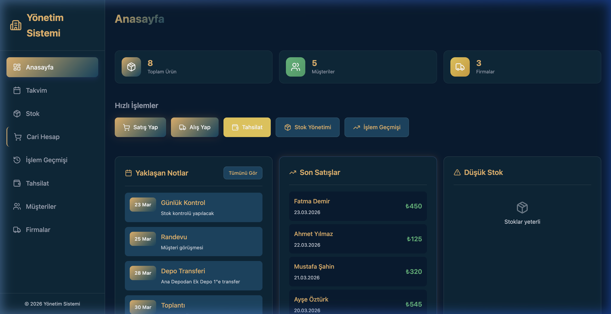
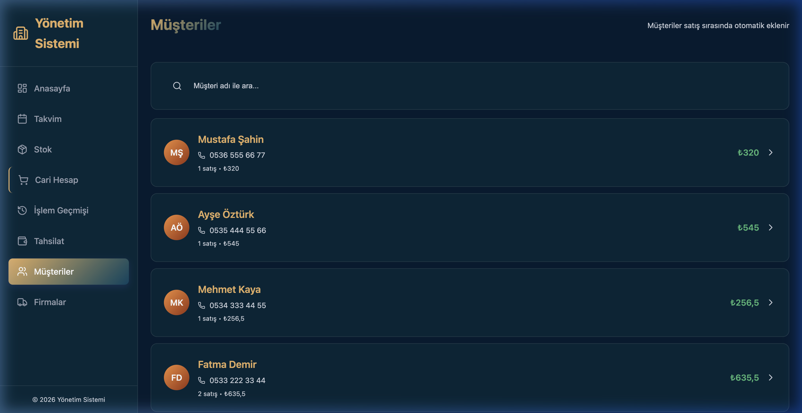
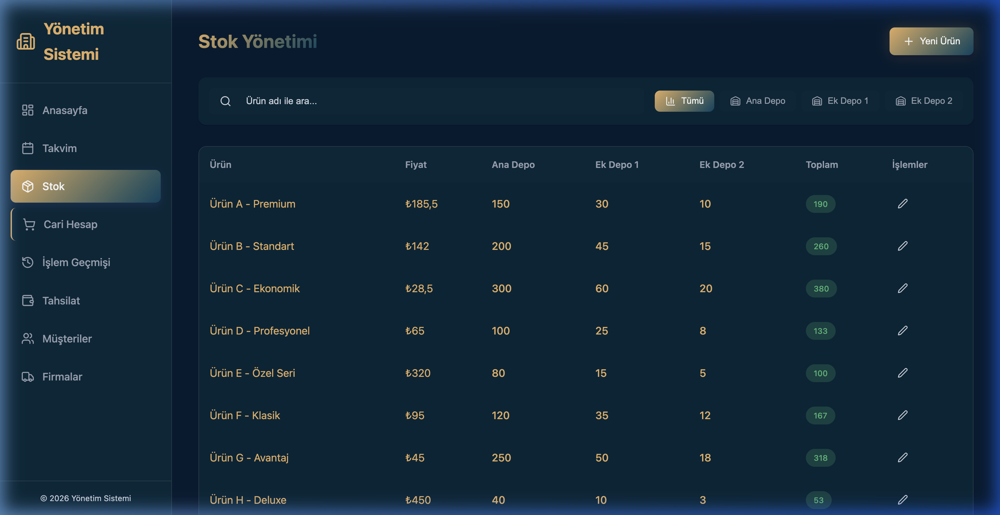

# Yönetim Sistemi Template 🚀

Modern, hızlı ve markalaştırılabilir bir yönetim/stok/cari takip sistemi şablonu. React, TypeScript, Vite ve Supabase altyapısı kullanılarak geliştirilmiştir. Desktop uygulaması desteği de mevcuttur (Electron).

> **💡 Canlı Demo:** [Vercel Demo Linki Buraya Gelecek]

## Özellikler

- **Müşteri & Toptancı Yönetimi:** Cari hesap takibi
- **Satış & Satın Alma:** Detaylı işlem geçmişi ve sepet mantığı
- **Stok Takibi:** Çoklu depo desteği ve stok limiti uyarıları
- **Finans:** Nakit, kredi kartı, çek, senet, borç silme (helalleşme) işlemleri
- **Dashboard:** Özet istatistikler, son işlemler ve grafikler
- **PDF Dışa Aktar:** Raporları saniyeler içinde PDF'e dökme
- **PWA / Desktop:** Electron altyapısıyla bağımsız masaüstü kurulum imkanı

---

## 🚀 Hızlı Başlangıç

Bu proje kutudan çıktığı gibi çalışmaya hazırdır. **Supabase kurmanıza gerek kalmadan** içindeki "Mock Data" (örnek veriler) ile hemen test edebilirsiniz.

```bash
# 1. Projeyi klonlayın
git clone <repo-url>
cd ManagementSystem

# 2. Bağımlılıkları yükleyin
npm install

# 3. Geliştirme sunucusunu başlatın
npm run dev
```

> **Giriş Bilgileri:** Sistem varsayılan olarak `0000` PIN kodu ile korunmaktadır.

---

## 📸 Ekran Görüntüleri (Ocean Teması)

Sistemde dinamik renk teması özelliği mevcuttur. Aşağıdaki görseller varsayılan **Ocean** temasına aittir:





---

## 🛠 Gerçek Veritabanına Bağlanma (Supabase)

Eğer kendi veritabanınızı bağlamak isterseniz, bu proje native olarak Supabase destekler.

1. [Supabase](https://supabase.com/)'de yeni bir proje oluşturun.
2. `src/lib/database_rebuild.sql` dosyasındaki SQL komutlarını Supabase SQL Editor'da çalıştırarak tabloları oluşturun.
3. Kök dizindeki `.env.example` dosyasının adını `.env` olarak değiştirin ve Supabase bilgilerinizi girin:

```env
VITE_SUPABASE_URL=https://<your-project-id>.supabase.co
VITE_SUPABASE_ANON_KEY=eyJhbGciOiJIUzI1...
```
*(Not: Bu bilgileri girdiğiniz anda sistem otomatik olarak örnek verileri bırakıp sizin veritabanınızı kullanmaya başlar.)*

---

## 🎨 Kendi Markanıza Uyarlama (White-label)

Bu projeyi şirketiniz için özelleştirmek çok kolaydır:

1. **Tema Rengi:** `src/config/themeConfig.ts` dosyasındaki `ACTIVE_THEME` değişkenini `default`, `forest`, `sunset`, `ocean`, `mint`, `rmint` veya `monochrome` yaparak saniyeler içinde uygulamanın tüm havasını değiştirebilirsiniz.
2. **Logo:** `public/vite.svg` yerine kendi logonuzu `public/logo.png` olarak ekleyin ve `index.html` ile `src/components/Layout/Layout.tsx` içindeki referansları güncelleyin.
3. **Uygulama Adı:** 
   - `index.html` > `<title>`
   - `src/components/Layout/Layout.tsx` > Yönetim Sistemi başlıklarını değiştirin.
   - `src/utils/pdfExport/pdfStyles.ts` > `COMPANY_INFO` nesnesini kendi firma bilgilerinizle doldurun.
3. **Masaüstü (Electron) Uygulaması:**
   - `electron/main.js` ve `electron/preload.js` içindeki pencerelerin başlıklarını güncelleyin.
   - `electron/package.json` içindeki `name`, `productName` ve `appId`'yi kendi markanıza göre değiştirin.
   - Masaüstü derlemesi yapmak için: `cd electron && npm install && npm run build:win` (veya `:mac`, `:linux`)

---

## 🌐 Vercel Üzerinde Yayınlama

Bu projeyi Vercel üzerinden ücretsiz bir şekilde canlı yayına alabilirsiniz:

1. Projenizi GitHub'a pushlayın.
2. [Vercel](https://vercel.com/)'e giriş yapıp "Add New Project" deyin.
3. GitHub reponuzu seçin.
4. Çıkan ekranda ayarlar otomatik dolacaktır (Framework: Vite).
5. (Opsiyonel) Eğer gerçek veritabanınızı bağlamak istiyorsanız Vercel Dashboard'daki Environment Variables kısmına `VITE_SUPABASE_URL` ve `VITE_SUPABASE_ANON_KEY` değerlerinizi girin.
6. **Deploy** butonuna basın.

Uygulamanız yayında! 🚀
